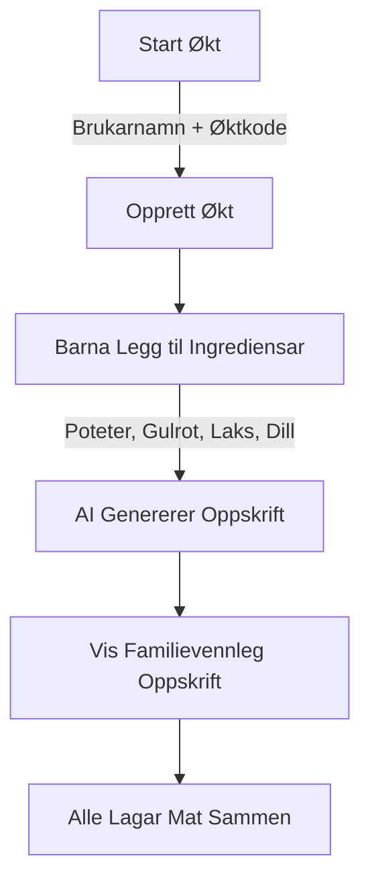
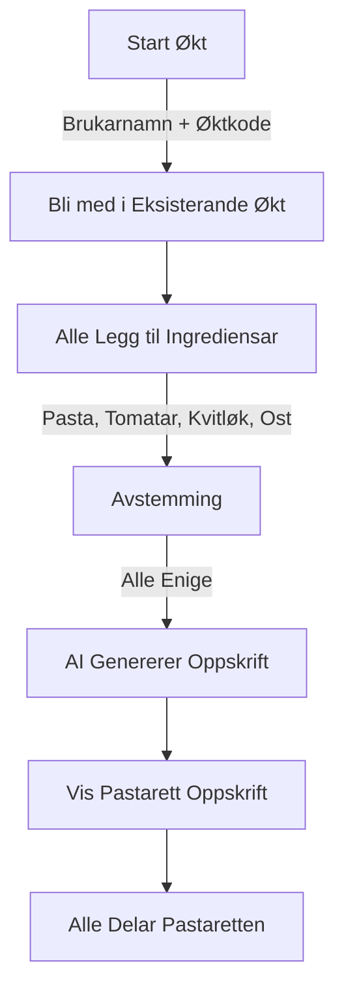
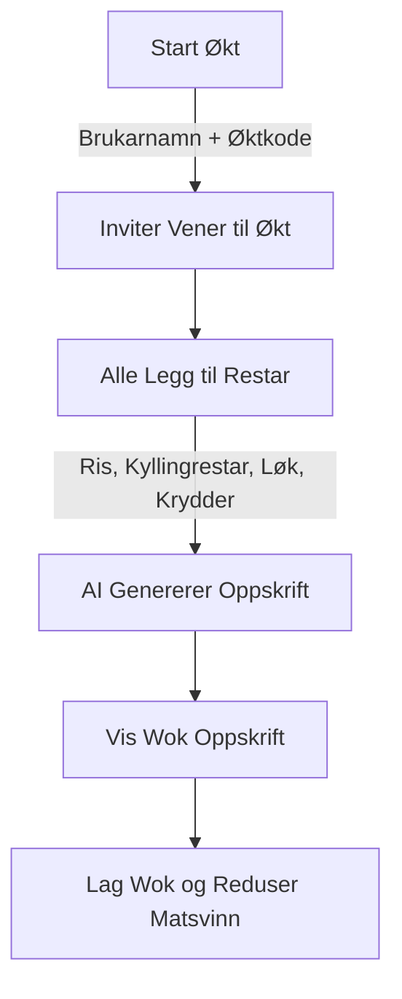

---

# MatMix: Interaktivt Samarbeid om Matlaging

[GitHub Repository](https://github.com/lukketsvane/matmix)

---

## Oversikt

MatMix er ei plattform der brukarar kan skape kreative måltid i fellesskap, gjennom å samarbeide om ingrediensane dei har tilgjengeleg. Gjennom sanntidsinteraksjon og AI-assistert oppskriftsgenerering, tilbyr MatMix ei sosial og innovativ tilnærming til matlaging.

MatMix er ei interaktiv matlagingsapp der brukarar kan samarbeide i sanntid for å lage kreative oppskrifter basert på ingrediensane dei har. Dette dokumentet gir oversikt over funksjonane, teknisk arkitektur, datamodell og brukarforteljingar som viser korleis applikasjonen kan brukast.

---

## Filstruktur

```
matmix/
  ├─ app/
  │  ├─ [code]/
  │  │  └─ page.tsx
  │  ├─ fonts/
  │  │  ├─ GeistMonoVF.woff
  │  │  └─ GeistVF.woff
  │  ├─ favicon.ico
  │  ├─ globals.css
  │  ├─ layout.tsx
  │  └─ page.tsx
  ├─ components/
  │  ├─ ui/
  │  │  ├─ button.tsx
  │  │  ├─ card.tsx
  │  │  ├─ checkbox.tsx
  │  │  ├─ dialog.tsx
  │  │  ├─ input.tsx
  │  │  ├─ label.tsx
  │  │  ├─ scroll-area.tsx
  │  │  ├─ select.tsx
  │  │  ├─ switch.tsx
  │  │  ├─ table.tsx
  │  │  ├─ toast.tsx
  │  │  ├─ toaster.tsx
  │  │  ├─ tooltip.tsx
  │  │  └─ use-toast.ts
  │  └─ matmix.tsx
  ├─ hooks/
  │  └─ use-toast.ts
  ├─ lib/
  │  └─ utils.ts
  ├─ public/
  │  └─ music/
  │     ├─ alt03-answer_010sec.mp3
  │     └─ lobby-classic-game.mp3
  ├─ .env
  ├─ .eslintrc.json
  ├─ .gitignore
  ├─ components.json
  ├─ filetree.txt
  ├─ next.config.mjs
  ├─ package-lock.json
  ├─ package.json
  ├─ postcss.config.mjs
  ├─ README.md
  ├─ tailwind.config.ts
  └─ tsconfig.json
```

---

## Hovudfunksjonar

- **Sanntids Samarbeid**: Brukarar kan opprette eller bli med i ei økt (opp til seks personar) for å legge til ingrediensar.
- **Ingredienshåndtering**: Brukarar kan legge til, redigere og slette ingrediensar.
- **AI-drevet Oppskriftsgenerering**: Bruk AI for å generere ei oppskrift basert på valde ingrediensar.
- **Øktstyring**: Den som opprettar ei økt kan styre prosessen, inkludert avstemming og nedteljing.

---

## Brukargrensesnitt

- **Innlogging**: Start ei ny økt eller bli med i ei eksisterande ved å bruke ein 4-sifra kode.
- **Hovudskjerm**: Liste over ingrediensar som brukarar kan leggje til, redigere eller slette.
- **Oppskriftsgenerering**: Generer oppskrifter ved hjelp av AI og last dei ned eller del dei.

---

## Flytdiagram for Brukarforteljingar

### 1. Småbarnsfamilien



**Beskrivelse**: Kari og familien brukar MatMix til å lage middag saman. Barna legg til ingrediensar dei finn på kjøkenet, og AI-en lagar ei enkel oppskrift som alle kan vere med på å lage.

---

### 2. Kollektivet



**Beskrivelse**: Med få ingrediensar igjen bestemmer kollektivet seg for å lage noko saman. Etter avstemming vel dei alle ingrediensane, og MatMix lagar ei oppskrift på ein enkel pastarett.

---

### 3. Matsvinn-entusiasten



**Beskrivelse**: Ola inviterer vener til ei økt for å redusere matsvinn. Dei legg til restane dei har, og MatMix gir dei ei oppskrift på ein smakfull wok som nyttar alle ingrediensane utan at noko går til spille.

---

## Teknisk Funksjonalitet

| Funksjonalitet                     | Teknologi                | Beskriving                                                                        |
| ---------------------------------- | ------------------------ | --------------------------------------------------------------------------------- |
| **Frontend**                       | React, Next.js           | Utvikling av eit responsivt og brukarvennleg grensesnitt.                         |
| **Backend**                        | Node.js, Express         | Handtering av brukarforespørslar og kommunikasjon mellom frontend og AI-tenester. |
| **Sanntidskommunikasjon**          | WebSockets (socket.io)   | Moglegheit for at fleire brukarar kan samhandle i sanntid.                        |
| **AI-drevet Oppskriftsgenerering** | Anthropic API            | Generering av oppskrifter basert på ingrediensane lagt til av brukarane.          |
| **Database**                       | MongoDB eller PostgreSQL | Lagring av øktdata, ingrediensar og oppskrifter midlertidig under ei økt.         |
| **Autentisering**                  | JSON Web Tokens (JWT)    | Autentisering av brukarar som opprettar eller blir med i ei økt.                  |
| **Responsivt Design**              | CSS, Tailwind CSS        | Funksjonalitet som fungerer sømlaus både på skrivebord og mobile einingar.        |

---

## Datamodell

| Datamodell     | Attributt               | Beskriving                                                           |
| -------------- | ----------------------- | -------------------------------------------------------------------- |
| **Økt**        | Økt-kode                | Unik identifikator for økta.                                         |
|                | Liste over deltakarar   | Inneheld alle deltakarane i ei økt.                                  |
|                | Liste over ingrediensar | Inneheld alle ingrediensane lagt til av deltakarane i økta.          |
| **Ingrediens** | Namn                    | Namnet på ingrediensen.                                              |
|                | Mengde                  | Mengda av ingrediensen, t.d. 500 gram.                               |
|                | Eining                  | Eining som blir brukt, t.d. gram, stk, ss.                           |
|                | Kategori                | Kategori som ingrediensen høyrer til, t.d. grønsaker, kjøt, krydder. |
|                | Brukar                  | Brukaren som la til ingrediensen i økta.                             |
| **Oppskrift**  | Tittel                  | Tittel på oppskrifta.                                                |
|                | Skildring               | Kort skildring av retten.                                            |
|                | Ingrediensliste         | Liste over ingrediensane som blir brukt i oppskrifta.                |
|                | Framgangsmåte           | Steg-for-steg instruksjonar for korleis ein lagar retten.            |

---

## Vidare Utvikling

- **Integrasjon med Matvareleveringstenester**: Bestill ingrediensar direkte frå appen basert på genererte oppskrifter.
- **Lagre Favorittoppskrifter**: Moglegheit for å lagre oppskrifter for framtidig bruk.
- **Utvida Kategorisering og Filtrering**: Filtrer ingrediensar etter kategori, tilgjengelegheit, eller preferansar som vegetar eller vegansk.

> Vurder å inkludere spesifikke teknologiar/metodar for vidare utviklingspunkt.

---

## Tekniske Vurderingar

- **Rammeverk**: Bruk **React** med **Next.js** for frontend, og **Node.js** og **Express** for backend.
- **Bibliotek**: Bruk **D3.js** for å lage flytskjema, **GSAP** for animasjonar, og **React Spring** for overgangseffektar.
- **Responsivt Design**: Applikasjonen bør fungere sømlaus på både skrivebord og mobile einingar.
- **Utplassering**: Applikasjonen kan hostast på ein server for live tilgang eller pakkast som ein nedlastbar pakke for offline-bruk.

---

For meir informasjon og bidrag, sjå vårt [GitHub Repository](https://github.com/lukketsvane/matmix).

---